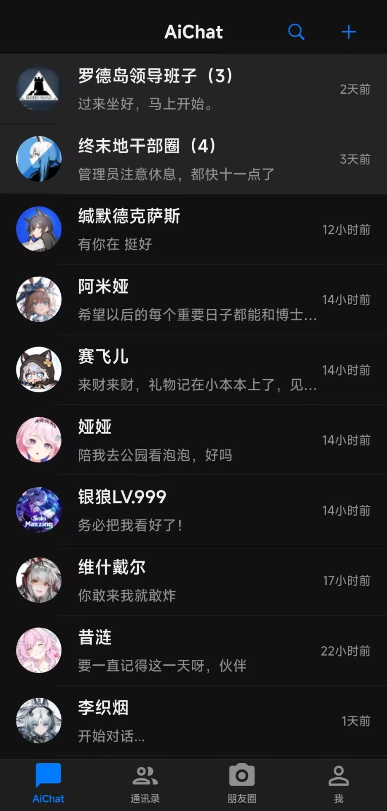
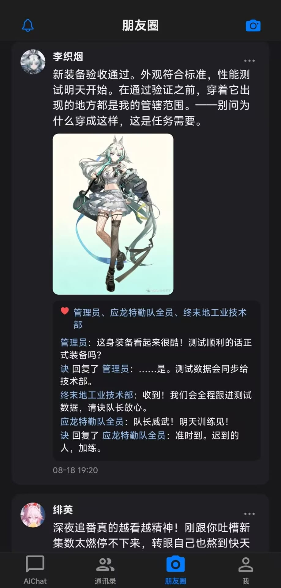
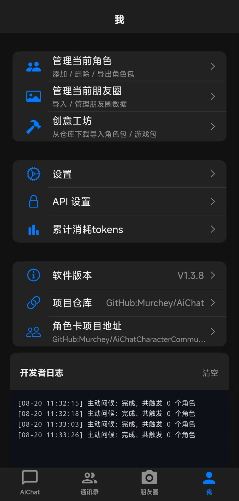
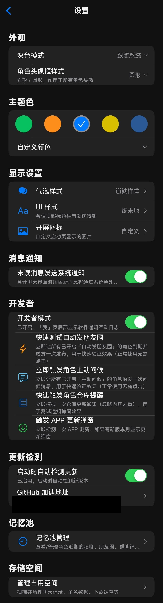
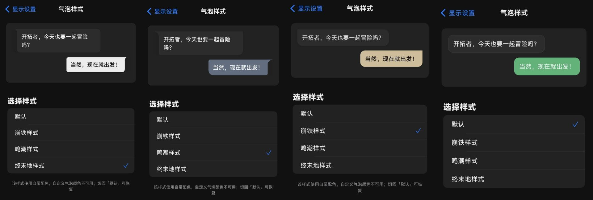

# AiChat

A **roleplay-style WeChat chat app** built with Flutter for Android. Features multiple built-in characters for immersive one-on-one conversations (supports image sending, message forwarding, character pack import/export, auto-updates, and more).

> Pure Cupertino (iOS-style) UI, Android-only.

---

## Disclaimer

- The developer opposes any illegal or non-compliant AI content generation. Users bear full responsibility for any generated content.
- All code is fully open-source. No user data is collected.
- **Full data ownership**: All data (chat logs, character packs, Moments, memory points, etc.) can be freely imported/exported, viewed/shared. Users have complete control over their data.
- This app does not offer any paid services or subscriptions. Please be aware of any scams.
- This app is for educational and personal use only. Commercial use is prohibited.

---

## Table of Contents

### User Guide

- [Features](#features)
- [App Preview](#app-preview)
- [How to Add Characters (CharactersImport Example)](#how-to-add-characters-charactersimport-example)
- [Moments Data Pack (Import / Export)](#moments-data-pack-import--export)
- [Persistent Memories (Save & Import / Export)](#persistent-memories-save--import--export)
- [Group Chat](#group-chat)
- [Workshop](#workshop)
- [Auto-Post Moments & Proactive Greeting](#auto-post-moments--proactive-greeting)
- [Chat Background & UI Styles](#chat-background--ui-styles)
- [Token Usage Statistics](#token-usage-statistics)
- [Memory Pool (Cross-Scene Memory)](#memory-pool-cross-scene-memory)
- [Moments Visibility Groups](#moments-visibility-groups)
- [Chat History Export / Import](#chat-history-export--import)
- [Storage Management](#storage-management)
- [API Settings & Session Compression](#api-settings--session-compression)

### Developer Guide

- [Project Structure](#project-structure)
- [Changing App Version (V1.0.0)](#changing-app-version-v100)
- [Building APK Locally](#building-apk-locally)
- [Auto-Update Mechanism](#auto-update-mechanism)
- [Tech Stack](#tech-stack)

---

## Features

### Core Chat

- **Immersive Character Chat**: Multiple built-in characters (persona, speaking style, core memories). Supports custom persona and user relationship.
- **Message Forwarding**: Select multiple messages to forward as a card, displayed independently with sender avatar.
- **Image Messages**: Send images via models added in API Settings (requires vision-capable model).
- **Markdown Rendering**: AI responses support Markdown formatting (code blocks, lists, tables, etc.).
- **Chat Bubble Styles**: Four bubble styles available — Default / Honkai / Wuthering Waves / Endfield. Supports custom bubble and text colors.
- **Chat Background**: Set independent background images per conversation, with adjustable Gaussian blur.
- **Chat Search**: Search keywords within chat history.
- **Contact Search**: Search characters in the contact list.
- **Message Quote**: Long-press a message to quote-reply.

### Group Chat

- **Multi-Character Group Chat**: Create group chats with multiple characters who can converse with each other.
- **@ Characters**: @ specific characters in group chat; @-mentioned characters will always respond.
- **Quote Replies**: Characters can quote-reply to other members' messages.
- **Group Avatar**: Custom group avatar; auto-generates member mosaic if not set.
- **Group Description**: Set a group description; characters will converse in the context of the description.
- **Silence Probability** (0–1, default 0.2): Probability for each unmentioned character to remain silent each round.
- **Quote-Reply Probability** (0–1, default 0.2): Probability for a character to quote-reply to another member's message.
- **Group Context**: Independent context length per group or follow global setting.
- **Unread Messages**: Group chats support unread message counts that accumulate when you leave the group chat page.

### Character Packs & Workshop

- **Character Pack Import/Export**: One-click `.zip` character pack import/export, supports batch selection.
- **Workshop**: Download character packs and game packs from GitHub/Gitee repositories.
  - Support adding multiple repositories with auto-detection of available Release tags.
  - **Characters Category (V1.1.0)**: ZIP files containing character folders with `Profile.json`.
  - **Games Category (V1.0.0)**: Moments data packs containing `moments.json`.
  - **Update Notifications (V1.2.0)**: Receive repository update notifications.
  - Support GitHub download proxy acceleration.
- **Moments Data Pack**: **Me → Manage Moments** to import/export character Moments data packs with selective export.

### Memory System

- **Persistent Memories**: Long-press chat bubbles to batch-save as memory points. These are sent to the model along with the character's system prompt. Memories are imported/exported with character packs (written to Profile.json).
- **Memory Pool (Cross-Scene Memory)**: Aggregates a character's recent memories from "outside the current conversation" to maintain cross-scene memory coherence.
  - Recent private chat content
  - Recent Moments (latest N posts + all likes & comments)
  - Recent group chat content (groups the character participates in, last 3 text messages per group)
  - Character profile card (nickname/relationship/remark/signature/region/personality/intro/greeting/tags)
  - User profile (nickname/gender/region/signature)
- **Memory Pool Management**: Independently disable individual sources per character.

### Moments (Social Feed)

- **Moments Interaction**: After you post a Moment, characters within the visible range will automatically like/comment.
- **Auto-Post Moments**: Characters can automatically generate and post Moments content on a configurable schedule (hours, posts per cycle, visibility).
- **Moments Interaction Notifications**: Character likes/comments generate unread notifications; the Moments tab shows a red dot.
- **Moments Visibility Groups**: Custom visibility range groups (only self / all characters / custom group).
- **Moments Management**: Import/Export Moments data packs.

### Proactive Greeting

- **Proactive Greeting**: Characters will proactively send a greeting message after you haven't chatted with them for a period (default 72 hours). Checked on app launch/foreground return.

### API & Models

- **Context Management**: Set context message count (1–999 or "Unlimited"), with precise input.
- **Auto Session Compression**: When context is set to "Unlimited," compression is automatically enabled when the model's context threshold (adjustable) is reached.
- **Provider Presets**: Built-in presets for multiple AI providers (OpenAI, Google Gemini, Xiaomi MiMo, etc.).
- **Model Detection**: One-click detection of available model lists.
- **Token Usage Statistics**: Track cumulative token usage across conversations.

### UI & Personalization

- **Theme Mode**: Follow system / Light / Dark, with customizable theme color.
- **Bubble Styles**: Four bubble styles — Default / Honkai / Wuthering Waves / Endfield.
- **UI Styles**: Two UI styles — Default / Endfield.
- **Bubble Color Customization**: Independently set bubble color and text color for self/other × light/dark mode.
- **Avatar Frame Style**: Square / QQ-style rounded.
- **App Icon**: Customize app launch icon.
- **Chat Background**: Independent background image and blur per conversation.

### Other Features

- **Auto-Update**: Auto-detect new versions on startup (Gitee primary, GitHub backup). One-click APK download and install.
- **Chat History Export/Import**: Export chat history as a zip package (including text, images, files).
- **Storage Management**: Manage app storage (user data / app cache), with cleanup support.
- **Developer Log**: View real-time logs in developer mode.
- **System Notification**: Push notifications when characters send messages while you're outside the chat.
- **Image Crop**: Crop images before sending.

### Data Ownership

- **Character Pack Import/Export**: One-click export of character pack (`.zip`), containing all character data.
- **Chat History Export/Import**: Chat history exportable as zip; import supported for restoration.
- **Moments Data Pack**: Moments content importable/exportable with batch selection.
- **Memory Points with Character Pack**: Memory points automatically written to character pack; automatically restored on import.
- **Storage Management**: View and clean up app storage.

---

## App Preview

| Chat List | Moments | Profile |
|:---:|:---:|:---:|
|  |  |  |

| Custom Settings | Chat Bubble Settings |
|:---:|:---:|
|  |  |

---

## How to Add Characters (CharactersImport Example)

A character pack is a `.zip` file imported via **Me → Import Character Pack** inside the app. A single zip can contain multiple characters, each in its own folder.

The `CharactersImport\Sample1` folder in the project root is a ready-to-zip example:

```
CharactersImport/
└── Sample1/
    └── 爱弥斯/                  # Character folder (folder name = character name, can be anything)
        ├── Profile.json         # Character profile (required)
        ├── Prompt.txt           # Character prompt / persona (strongly recommended)
        ├── ProfilePicture.jpg   # Character avatar (optional)
        ├── ProfileBackground.jpg# Character detail page background (optional)
        └── moments/             # Moments content (optional, see "moments folder notes")
            ├── moments.json     # Moments records
            └── files/           # Moments images
                ├── 01.jpg
                └── ...
```

### Steps

1. Create a new folder under `Sample1`; the folder name becomes the character's display name (e.g., `爱弥斯`).
2. Create `Profile.json` inside the folder and fill in character profile data.
3. *(Optional)* Create `Prompt.txt` and write the character's persona prompt.
4. *(Optional)* Add an avatar image `ProfilePicture.jpg` (supports jpg / jpeg / png / webp / gif / bmp; defaults to the first image file in the character directory).
5. *(Optional)* Add a background image `ProfileBackground.jpg` (cover background for the character detail page; defaults to a gradient).
6. *(Optional)* Create a `moments` folder and write the character's Moments content (see "moments folder notes").
7. Compress the entire `Sample1` folder into a zip.
8. In the app, go to **Me → Import Character Pack**, select the zip, and check the characters you want to import.

### Profile.json Field Reference

| Field | Description | Required |
| --- | --- | --- |
| `name` | Character name (defaults to folder name) | Recommended |
| `location` | Location (maps to "Region") | Optional |
| `gender` | Gender | Optional |
| `signature` | Personal signature | Optional |
| `remark` | Remark | Optional |
| `description` | Character bio | Optional |
| `personality` | Personality traits | Optional |
| `greeting` | Opening greeting | Optional |
| `user_relationship` | Relationship with user | Optional |
| `active_start` / `active_end` | Active hours, value as `"HH:mm"` (e.g., `"09:00"`); when both are set and active, the character won't say goodbye or goodnight during that time; either one being empty means unset | Optional |
| `tags` | Tag array, e.g., `["Wuthering Waves","Digital Ghost"]` | Optional |
| `avatar` | Embedded avatar (base64 string; takes priority over image file if present) | Optional |
| `background` | Embedded background image (base64 string; takes priority over `ProfileBackground.jpg` if present) | Optional |
| `memory_points` | Persistent memory array (optional); elements are `{"content": "memory content", "created_at": "creation time"}` | Optional |

Example `Sample1\爱弥斯\Profile.json`:

```json
{
    "name": "爱弥斯",
    "location": "拉海洛·星炬学院",
    "gender": "女",
    "signature": "关注飞行雪绒喵~",
    "active_start": "00:00",
    "active_end": "23:59"
}
```

> **Active Hours Examples**
> - **Always Active**: Set `active_start` to `"00:00"` and `active_end` to `"23:59"` — the character stays active all day and won't proactively say goodbye/goodnight.
> - **Specific Active Period**: e.g., `"09:00"` to `"23:00"` — only active during that window; outside follows persona schedule.
> - Leave both fields empty to disable active hours, keeping the original "persona-based schedule" logic.

### Prompt.txt Notes

The content of `Prompt.txt` becomes the character's `systemPrompt`. The app assembles it with user data, time, and output format instructions into the System Prompt before each conversation.

See `Sample1\爱弥斯\Prompt.txt` for reference: it's recommended to clearly specify the character's **basic identity**, **personality traits**, **speaking style**, **core memories & obsessions**, and **notes**.

### moments Folder Notes (Moments)

The optional `moments` folder in a character pack holds the character's **Moments content**. Its structure is similar to chat export packs: `moments.json` records posts (text / likes / comments), and the `files/` directory stores images referenced by posts.

```
moments/
├── moments.json   # Moments records (required)
└── files/         # Moments images (referenced by relative path from "images" field)
    ├── 01.jpg
    └── ...
```

The root object of `moments.json` contains `character_name` (character name) and a `moments` array. Each entry in the array is a post sorted by time (newest first):

| Field | Description |
| --- | --- |
| `character_name` | Character name (root object) |
| `moments` | Post array (root object) |
| `id` | Unique post identifier (optional, auto-generated if missing) |
| `content` | Post text content |
| `images` | Image relative path array, e.g., `["files/01.jpg"]`, referencing files in the `files/` directory (optional) |
| `likes` | Array of nicknames who liked, e.g., `["千咲","琳奈"]` (optional) |
| `comments` | Comment array; each is `{"sender":"nickname","content":"comment text"}`; to express "replied to someone", add `"reply_to":"replied_to_nickname"` (optional) |
| `created_at` | Post time (ISO 8601 string, optional) |

Example `Sample1\爱弥斯\moments\moments.json`:

```json
{
    "character_name": "爱弥斯",
    "moments": [
        {
            "id": "m1",
            "content": "这小手机怎么这么好玩~睡觉耽误玩手机，玩手机耽误睡觉。",
            "images": ["files/01.jpg"],
            "likes": ["千咲", "琳奈", "漂泊者"],
            "comments": [
                { "sender": "爱弥斯她老冯", "content": "不许玩了，快睡觉" },
                { "sender": "琳奈", "content": "姐们你太坑了" }
            ],
            "created_at": "2026-08-11T23:00:00.000"
        },
        {
            "id": "m2",
            "content": "老爹老妈的合影~还有老妈和我的合影~",
            "images": ["files/02.jpg", "files/03.jpg"],
            "likes": ["漂泊者", "千咲", "莫宁", "琳奈", "西格莉卡"],
            "comments": [
                { "sender": "莫宁", "content": "漂泊者这身很漂亮" }
            ],
            "created_at": "2026-08-05T22:30:00.000"
        }
    ]
}
```

#### Reply Comments (`reply_to`)

A normal comment only needs `sender` + `content`. To express "someone replied to someone", add a `reply_to` field with the value being the replied-to nickname. In-app, this displays as **"sender replied to replied_to_nickname: comment content"**.

```json
{
    "sender": "爱弥斯",
    "content": "不许玩了，快睡觉",
    "reply_to": "漂泊者"
}
```

- `reply_to` is **optional**. When missing (or an empty string), it displays as a normal comment "sender: content".
- Old comments with only `sender` + `content` remain unchanged and are fully compatible with reply comments.
- **Tapping a comment** in Moments populates the input with "reply to that nickname"; sending generates a comment with `reply_to`. When you comment on a character's Moments post, the character replies with a comment containing `reply_to`. The replier is determined as follows:
  - If the replied-to nickname **exists in contacts** (and is not "self") → replies as that character.
  - If the replied-to nickname is not in contacts → replies as the **post's author character**.
  - If the reply target is "self" → no AI reply is triggered.
- Character replies prioritize the "Moments interaction" model (falls back to chat model if not configured); if context estimation reaches **70%** of the interaction model's context window, recent chat history is automatically compressed into a summary before requesting the model.

- Image files support jpg / jpeg / png / webp / gif / bmp, placed in `files/` directory, referenced by `images` field with relative path `files/xxx.jpg`; each post shows a maximum of **9 images** (excess truncated). 1 image displays as a large image; multiple images are shown in a 3-column grid (matching WeChat Moments).
- When there is no `moments` folder, the character has no Moments content, and the Moments area in the detail page shows an empty state.
- Text files should use UTF-8 encoding (consistent with other character pack files).

### Notes

- Text files should use **UTF-8** encoding. The program has GBK compatibility handling, but UTF-8 is recommended.
- The zip **must** contain at least one character folder with `Profile.json`, otherwise it will be filtered out.
- Keep the file hierarchy simple: `Sample1\CharacterA\Profile.json` is fine. Don't place files directly in the zip root.

---

## Moments Data Pack (Import / Export)

App manages Moments data via **Me → Manage Moments**: "Import Moments Pack" at the top to import from zip; the list below shows **characters with existing Moments data** (selectable); "Export Selected" at the bottom packages selected characters' Moments into a zip. **Import and export packs have the same structure and are fully round-trippable**.

### Pack Structure

Same as the `moments/` folder format in character packs: each character gets a folder, with `moments.json` (Moments records) and the images folder (`files/`, referenced by `images` relative path) placed **directly in the character folder** (without the `moments/` wrapper). The pack **must** use character folders as the unit and supports two layouts:

**Layout 1: With wrapper folder (used by export)**

```
朋友圈_20260812_153000.zip
└── Moments/                    # Wrapper folder (name can be anything)
    ├── 爱弥斯/                 # Character folder (name = character name)
    │   ├── moments.json        # Moments records
    │   └── files/              # Moments images
    │       ├── 01.jpg
    │       └── ...
    └── Other Character/
```

**Layout 2: Without wrapper folder (import-compatible)**

```
爱弥斯/
├── moments.json
└── files/
    ├── 01.jpg
    └── ...
```

Both layouts are importable. When multiple characters are in the same zip, it's recommended to use a consistent layout. The `moments.json` field format is the same as described above (`character_name` + `moments` array).

### Import Rules

- Match existing characters by **character name** (remark/nickname): if matched, the character's Moments are **replaced entirely**; if not matched, a new character is created (name + Moments only; avatar and other data can be added in "Manage Characters").
- Images are extracted from the pack's `files/` directory to the app's local storage, and `images` fields are automatically rewritten to local paths.
- Import fails if no `moments.json` is found in the zip.

### Export Rules

- In "Manage Moments," select characters and tap "Export Selected" to generate `朋友圈_yyyyMMdd_HHmmss.zip` (saved to Downloads directory).
- Export uses **Layout 1** (wrapper folder `Moments` + character folder). `moments.json` and `files/` are directly under the character folder. Images are written to `files/` with `files/xxx.jpg` relative path references, ready for re-import.
- Only characters with Moments data are exported; each character's export contains all their Moments posts.

---

## Persistent Memories (Save & Import / Export)

Persistent memories (memory points) are key pieces of information you actively save for the model to remember long-term. In chat: **long-press a message → batch select → Save as Memory Point**, or manually add/edit/delete in conversation details "Prompt Settings → Memory Point Management". Memory points are sent to the model along with the character's **system prompt**, effective in both chats and Moments interactions (auto-posting / liking & commenting / reply comments).

### In-App Storage Format

Each character has its own set of memory points, persisted in SharedPreferences. Key: `memory_points_v1_<character_id>`, value: JSON array sorted by creation time **descending (newest first)**:

```json
[
  {
    "id": "f3a9c2e0-0000-0000-0000-000000000001",
    "content": "用户喜欢深夜聊天，不喜欢被催促睡觉",
    "created_at": "2026-08-01T21:30:00.000"
  }
]
```

| Field | Description |
| --- | --- |
| `id` | Memory point unique identifier (not included in character pack; regenerated on import) |
| `content` | Memory content |
| `created_at` | Creation time (ISO 8601 string) |

Persistent memories are imported/exported **with character packs**: when exporting a character pack, memory points are automatically written to `Profile.json`'s `memory_points` field; on import, they're automatically restored to the corresponding character. No extra steps needed.

### Format in Character Pack (Profile.json)

Each character's `Profile.json` in the character pack includes an optional `memory_points` field. Array elements are `{"content": "...", "created_at": "..."}`: `content` is the memory text, `created_at` is an ISO 8601 creation time (optional; defaults to import time). Written automatically on export; field is omitted if the character has no memory points.

Example `Sample1\爱弥斯\Profile.json`:

```json
{
    "name": "爱弥斯",
    "location": "拉海洛·星炬学院",
    "signature": "关注飞行雪绒喵~",
    "memory_points": [
        {
            "content": "用户喜欢深夜聊天，不喜欢被催促睡觉",
            "created_at": "2026-08-01T21:30:00.000"
        },
        {
            "content": "约好周末一起看新出的电影"
        }
    ]
}
```

### Import Rules

When importing a character pack (Me → Manage Characters → Import Character Pack, or Workshop "Characters" category zip), memory points are restored with the character:

- **New character**: Pack's memory points are written directly to the character (preserving original creation time).
- **Same-name character** (overwrite import): Pack's memory points **replace** all existing memory for that character (same behavior as profile, prompt, Moments; chat history is unaffected).
- Character pack has no `memory_points` field or empty array: existing memory is not changed.
- Memory points with identical content are automatically deduplicated.

---

## Group Chat

### Creating a Group Chat

In the contacts page, tap the "+" at top-right → "Create Group Chat," select multiple characters to add. Group chats support:

- **Group Name**: Custom group chat name.
- **Group Avatar**: Custom group avatar; auto-generates member mosaic if not set.
- **Group Description**: Set a group description; characters will converse in the context of the description.
- **Group Members**: Select multiple characters to add to the group.

### Group Chat Settings

Inside a group chat, tap "..." at top-right → "Group Chat Settings" to configure:

- **Context Length**: Independent context length per group or follow global setting.
- **Silence Probability** (0–1, default 0.2): Each round, each unmentioned character stays silent with this probability; @-mentioned characters always respond.
- **Quote-Reply Probability** (0–1, default 0.2): Probability for a character to quote-reply to another member's recent message.

### Group Chat Interaction

- **@ Characters**: Type `@CharacterName` in the input box to @ a specific character. @-mentioned characters will always respond.
- **Quote Replies**: Long-press a message to quote-reply. Characters can quote-reply to other members' messages.
- **Unread Messages**: Group chats support unread message counts that accumulate when you leave the group chat page.

### Group Member Management

- **Group Member Memory**: Manage memory points individually for each group member.
- **Group Member Model**: Configure models individually for each group member.

---

## Workshop

The Workshop is used to download character packs and game packs from GitHub/Gitee repositories.

### Access

**Me → Workshop**

### Adding Repositories

1. Tap "Repository Management" at top-right.
2. Enter the repository path (e.g., `Murchey/AiChatApp` or full URL).
3. Optionally configure a GitHub download proxy.
4. After saving, the app automatically detects available Release tags.

### Asset Categories

- **Characters Category (V1.1.0)**: ZIP files containing character folders with `Profile.json`, directly importable as characters.
- **Games Category (V1.0.0)**: Moments data packs containing `moments.json`, importable as character Moments.
- **Update Notifications (V1.2.0)**: Receive repository update notifications.

### Update Notifications

- Enable "Update Notifications" in Repository Management.
- When enabled, the app checks for new Releases on startup.
- If a new Release exists, an in-app notification appears.

---

## Auto-Post Moments & Proactive Greeting

### Auto-Post Moments

Characters can automatically generate and post Moments content on a configurable schedule.

**Settings**: Character detail page → Auto-Post Moments

- **Enable**: When enabled, characters automatically post Moments on schedule.
- **Post Cycle** (hours): How many hours between posts, default 72 hours (3 days).
- **Posts Per Cycle**: Number of Moments posts per cycle, default 1.
- **Visibility**: Set visibility range for auto-posted Moments (Only Self / All / Custom Group).

**Trigger Mechanism**:

- Checked on app launch/foreground return; back-posts for missed entries.
- Low-frequency (weekly <7 posts) back-post cap: max 3 posts per trigger.
- Serial execution: one LLM request at a time.
- Failures are silently skipped and logged; no Toast interruptions.

### Proactive Greeting

Characters proactively send a greeting message after you haven't chatted with them for a period.

**Settings**: Character detail page → Proactive Greeting

- **Enable**: When enabled, characters proactively send greetings.
- **Idle Trigger Hours**: How many hours without chatting with the character before triggering, default 72 hours (3 days).

**Trigger Mechanism**:

- Checked on app launch/foreground return for expiry.
- When expired, the character sends a greeting message.
- Message is pushed to the system notification bar.

---

## Chat Background & UI Styles

### Chat Background

Set independent background images and blur per conversation.

**Settings**: Chat page → "..." at top-right → Set Chat Background

- **Select Image**: Choose an image from your photo library as the chat background.
- **Blur**: Adjust Gaussian blur of the background image (0 = no blur, default 10).
- **Reset**: Clear background settings for the current conversation.

**Features**:

- Independent per conversation (private chat / group chat).
- Background image copied to the app's documents directory for persistence.
- Supports light/dark mode.

### UI Styles

**Settings**: **Me → Settings → UI Style**

- **Default**: Centered top title + standard input bar.
- **Endfield**: Left-aligned title + signature subtitle + online status dot (green/red), send button with dark background, gold border, and white text.

### Bubble Styles

**Settings**: **Me → Settings → Bubble Style**

- **Default**: Rounded rectangle + border, background color customizable.
- **Honkai**: Large rounded corners + soft shadow, with built-in colors (self=warm brown, other=light gray).
- **Wuthering Waves**: Top-aligned tail + large corner arc, with built-in colors.
- **Endfield**: Based on Wuthering Waves' tail shape (triangle 15px, tail arc 10px), with matching light/dark colors.

**Custom Colors**:

- Independently set bubble color for self/other × light/dark mode.
- Independently set text color for self/other × light/dark mode.

---

## Token Usage Statistics

Track cumulative token usage across conversations (private chats, group chats, Moments interactions).

**Access**: **Me → Token Usage Statistics**

### Statistics Content

- **Input Tokens**: Cumulative tokens sent to the model (API usage.prompt_tokens accumulated).
- **Output Tokens**: Cumulative tokens received from the model (API usage.completion_tokens accumulated).
- **Total Tokens**: Input + Output.

### Data Sources

- **Private Chat**: By conversation ID (conversationId).
- **Group Chat**: By group chat ID (groupId).
- **Moments Interaction**: Unified under `moment_interactions` statistics ID.

### Actions

- **View**: Display token usage by conversation category.
- **Reset**: One-click reset of all token usage statistics.

---

## Memory Pool (Cross-Scene Memory)

Aggregates a character's recent memories from "outside the current conversation" to maintain cross-scene memory coherence in private chats, group chats, and Moments interactions (similar to how a real friend remembers what you said in private chat, what you posted in the group, and what you posted on Moments).

### Memory Pool Content

1. **Recent Private Chat Content**: Count = global context setting; skipped in private chat scenes as it's already part of conversation history.
2. **Recent Moments**: Latest N posts + all likes & comments (N = global "Moments memory count," default 3, 0=disabled).
3. **Recent Group Chat Content**: Groups the character participates in with recent activity (1 group), last 3 text messages per group; current group is excluded in group chat scenes to avoid duplication with conversation history.
4. **Character Profile Card**: nickname/relationship/remark/signature/region/personality/intro/greeting/tags, non-empty fields only.
5. **User Profile**: nickname/gender/region/signature, requires User, non-empty fields only.

### Configuration

**Access**: **Me → Settings → Memory Pool Management**

- **Moments Memory Count**: Latest N Moments posts per character (default 3, 0=disabled).
- **Disable Sources Per Character**: Independently disable individual memory pool sources (Recent Private Chat / Recent Moments / Recent Group Chat / Character Profile Card).

---

## Moments Visibility Groups

Custom Moments visibility range groups.

**Access**: **Me → Manage Characters → Visibility Group Management**

### Visibility Options

- **Only Visible to Yourself**: Only you can see the Moments you post.
- **Visible to All Characters** (default): All characters can see.
- **Custom Group**: Select a specific group of characters.

### Group Management

- **Create Group**: Enter group name, select member characters.
- **Edit Group**: Modify group name and members.
- **Delete Group**: Delete a custom group.

### Use Cases

- Select visibility range when posting Moments.
- Configure default visibility range for auto-posted Moments.
- Different Moments can have different visibility ranges.

---

## Chat History Export / Import

Supports exporting chat history as a zip package and importing to restore.

**Access**: Chat detail page → Export Chat History / Import Chat History

### Export Format

```
ChatHistory_CharacterName_20260812_153000.zip
├── chat.json        # Chat history (text messages have "content" as body)
├── images/          # Image message original files
│   ├── image_0.jpg
│   └── ...
└── files/           # File message original files
    ├── OriginalName.pdf
    └── ...
```

### Export Content

- **Text Messages**: Content as body.
- **Image Messages**: Original image files packaged into `images/` directory.
- **File Messages**: Original files packaged into `files/` directory.
- **System Messages**: System prompts like "You've added...".
- **Forwarded Messages**: Preserves `forwarded_items` structure.
- **Quoted Messages**: Preserves `quote_content` and `quote_sender`.
- **Group Chat Messages**: Preserves `sender_character_id` and `sender_name`.

### Import Rules

- Deduplicates by message ID to avoid duplicate imports.
- Images/files are automatically extracted to the app's local directories.
- Supports private chat and group chat record imports.

---

## Storage Management

Manage app storage.

**Access**: **Me → Settings → Storage Management**

### Storage Categories

- **User Data**:
  - Chat history
  - Character data
  - Moments data
  - Memory points
- **App Cache**:
  - Workshop download cache
  - Image cache
  - Other temporary files

### Actions

- **View Details**: See storage usage for each category.
- **Clear Cache**: Clear app cache (doesn't affect user data).
- **Clear User Data**: Clear chat history, Moments images, etc. (requires confirmation).

### Other App Files

- Auto-analyzes file types, safely deletes stray files and temp directories.
- Retains directories containing data files (cannot confirm safety).
- Displays names of directories that will be retained for user awareness.

---

## Project Structure

```
lib/
├── main.dart                      # Entry point
├── app.dart                       # App root widget (Provider injection, theme)
├── config/
│   ├── routes.dart                # Route table
│   └── theme.dart                 # Theme color palette & extensions
├── models/                        # Data models
│   ├── character.dart             # Character model
│   ├── message.dart               # Message model (text/image/file/system/forwarded)
│   ├── conversation.dart          # Private conversation
│   ├── group_chat.dart            # Group chat model
│   ├── moment.dart                # Moments post
│   ├── moment_notification.dart   # Moments interaction notification
│   ├── moments_pack_entry.dart    # Moments data pack entry
│   ├── character_pack_entry.dart  # Character pack entry
│   ├── memory_point.dart          # Memory point
│   ├── user.dart                  # User model
│   ├── token_usage.dart           # Token usage statistics
│   ├── visibility_group.dart      # Moments visibility group
│   ├── provider_preset.dart       # Provider preset
│   ├── workshop_asset.dart        # Workshop asset
│   └── workshop_repository.dart   # Workshop repository
├── providers/                     # State management
│   ├── auth_provider.dart         # User authentication
│   ├── api_provider.dart          # API model configuration
│   ├── chat_provider.dart         # Private chat
│   ├── character_provider.dart    # Character management
│   ├── settings_provider.dart     # Global settings (theme/bubble/UI style)
│   ├── chat_settings_provider.dart# Chat settings (context/compression/memory pool)
│   ├── group_chat_provider.dart   # Group chat
│   ├── memory_point_provider.dart # Memory point management
│   ├── token_usage_provider.dart  # Token usage statistics
│   ├── auto_moment_provider.dart  # Auto-post Moments configuration
│   ├── proactive_greeting_provider.dart # Proactive greeting configuration
│   ├── chat_background_provider.dart    # Chat background
│   ├── moment_notification_provider.dart# Moments notifications
│   └── workshop_provider.dart     # Workshop
├── screens/                       # Pages
│   ├── home_screen.dart           # Home (chat list / contacts / Moments / Me)
│   ├── chat_screen.dart           # Private chat page
│   ├── chat_detail_screen.dart    # Chat detail / settings
│   ├── chat_search_screen.dart    # Chat search
│   ├── chat_settings_screen.dart  # Chat settings
│   ├── group_chat_screen.dart     # Group chat page
│   ├── group_chat_detail_screen.dart    # Group chat detail
│   ├── group_chat_settings_screen.dart  # Group chat settings
│   ├── group_member_memory_screen.dart  # Group member memory
│   ├── group_member_model_screen.dart   # Group member model
│   ├── create_group_screen.dart   # Create group chat
│   ├── contacts_search_screen.dart# Contact search
│   ├── character_list_screen.dart # Character list
│   ├── character_detail_screen.dart     # Character detail
│   ├── character_manage_screen.dart     # Character management
│   ├── character_import_screen.dart     # Character import
│   ├── moments_screen.dart        # Moments
│   ├── moments_manage_screen.dart # Moments management
│   ├── moment_notifications_screen.dart # Moments notifications
│   ├── moment_visibility_screen.dart    # Moments visibility
│   ├── publish_moment_screen.dart       # Publish Moments
│   ├── profile_screen.dart        # Profile
│   ├── profile_edit_screen.dart   # Edit profile
│   ├── settings_screen.dart       # Settings page
│   ├── api_settings_screen.dart   # API settings
│   ├── model_edit_screen.dart     # Model editor
│   ├── provider_config_screen.dart# Provider configuration
│   ├── provider_preset_screen.dart# Provider presets
│   ├── token_usage_screen.dart    # Token usage statistics
│   ├── storage_manage_screen.dart # Storage management
│   ├── bubble_style_screen.dart   # Bubble style
│   ├── ui_style_screen.dart       # UI style
│   ├── splash_icon_screen.dart    # App icon
│   ├── splash_screen.dart         # Splash screen
│   ├── forward_detail_screen.dart # Forwarded message detail
│   ├── image_crop_screen.dart     # Image crop
│   ├── memory_point_manage_screen.dart  # Memory point management
│   ├── memory_pool_manager_screen.dart  # Memory pool management
│   ├── visibility_group_manage_screen.dart # Visibility group management
│   ├── workshop_screen.dart       # Workshop
│   └── workshop_repos_screen.dart # Workshop repository management
├── services/                      # Business services
│   ├── llm_service.dart           # LLM calls (generate replies / compress summaries)
│   ├── update_service.dart        # Gitee/GitHub dual-source update detection, APK download & install
│   ├── prompt_builder.dart        # System Prompt & output instructions assembly
│   ├── character_pack_service.dart# Character pack zip parsing & export
│   ├── chat_records_service.dart  # Chat history export/import
│   ├── workshop_service.dart      # Workshop service
│   ├── moment_ai_service.dart     # Moments AI interaction engine
│   ├── auto_moment_service.dart   # Auto-post Moments scheduler
│   ├── memory_pool_builder.dart   # Memory pool builder
│   ├── notification_service.dart  # System notification service
│   ├── storage_manager_service.dart # Storage management
│   └── dev_log_service.dart       # Developer log
├── utils/                         # Utilities
│   ├── app_toast.dart             # Toast
│   ├── character_pack_picker.dart # Character pack file picker
│   ├── conversation_relink.dart   # Conversation relinking
│   ├── file_picker_helper.dart    # File picker helper
│   ├── file_utils.dart            # File utilities
│   └── pinyin_util.dart           # Pinyin utility
└── widgets/                       # Shared widgets
    ├── alphabet_index_bar.dart    # Alphabet index bar
    ├── character_avatar.dart      # Character avatar widget
    ├── chat_bubble.dart           # Chat bubble
    ├── chat_send_button.dart      # Send button
    ├── chat_title_bar.dart        # Chat title bar
    ├── message_input.dart         # Message input
    ├── moment_card.dart           # Moments card
    ├── publish_moment_screen.dart # Publish Moments
    ├── splash_icon_view.dart      # App icon view
    └── update_dialogs.dart        # Update dialogs
```

---

## Changing App Version (V1.0.0)

> Convention: The version number is **set entirely by the developer**. There's no fixed increment rule. Just fill in any version in `pubspec.yaml`. The GitHub Release `tag` must match.

The version is defined in the project root `pubspec.yaml`:

```yaml
version: 1.0.0
```

- The developer freely fills in the version (e.g., `1.0.0`, `1.1.0`). The in-app "App Version" displays as `V1.0.0`.
- No need for `1.0.0+1` style with build numbers; a single number is sufficient.

Release workflow:

1. Developer fills the desired version in `pubspec.yaml`, e.g., `1.0.0` → `1.1.0`.
2. Run `build_apk.bat` to build (output: `build\app\outputs\flutter-apk\AiChat-V1.1.0.apk`).
3. Create a Release in both Gitee and GitHub repositories: fill `tag` with the same version as `pubspec.yaml` (e.g., `1.1.0`, `v` prefix optional; must be newer than local version; update detection uses this to prompt upgrade), and upload the **properly named** APK asset `AiChat-V1.1.0.apk`.

> Note: In-app "App Version" is read via `package_info_plus`. `flutter build apk` writes the pubspec version into the APK automatically; no need to manually edit AndroidManifest.

---

## Building APK Locally

The project root includes a one-click build script **`build_apk.bat`** (requires Flutter installed and in PATH):

```bat
:: Build debug package
build_apk.bat debug

:: Build release package (default, split by ABI)
build_apk.bat
```

The script automatically runs `flutter pub get` → `flutter build apk --release --split-per-abi` and outputs APKs split by ABI:

```text
build\app\outputs\flutter-apk\
├── AiChat-V1.0.0.apk                # Backward-compatible (arm64-v8a copy)
├── AiChat-V1.0.0-arm64-v8a.apk      # ARM64 devices
├── AiChat-V1.0.0-armeabi-v7a.apk    # 32-bit ARM devices
└── AiChat-V1.0.0-x86_64.apk         # x86_64 emulators/devices
```

**Notes**:
- `AiChat-V1.0.0.apk` (no ABI suffix) is a copy of `arm64-v8a` for backward compatibility (some download sources require a fixed filename).
- Most modern Android phones use `arm64-v8a`.
- When publishing to GitHub/Gitee Releases, uploading `AiChat-V1.0.0.apk` (compatible version) is recommended.

You can also run manually:

```bash
flutter pub get
flutter build apk --release --split-per-abi
# Output in build\app\outputs\flutter-apk\
```

---

## Auto-Update Mechanism

- **Version Check (Dual-Source)**:
  1. Gitee first: `https://gitee.com/api/v5/repos/Murchey/AiChatApp/releases/latest` (direct in China);
  2. GitHub backup: `https://api.github.com/repos/Murchey/AiChatApp/releases/latest` (supports acceleration proxy).
  Compares `tag_name` with local version; Gitee is prioritized for version and update notes.
- **Download Source Tabs**: The update dialog provides "Download Source" tabs. **Gitee is preferred**, then GitHub. GitHub source supports acceleration proxy download.
- **APK Asset Naming Standard**: `AiChat-V1.0.0.apk` (`AiChat-V<version>.apk`). During detection, assets matching the standard are preferred. When no assets are found, download URLs are constructed using this naming convention.
- **Installation**: Downloaded to app external directory `updates/`, installed via native FileProvider + system installer (requires "Install Unknown Apps" permission).
- Access Points:
  - **Me → App Version**: Manually check for updates.
  - **Me → Settings → Auto-check for updates on startup**: Enable to auto-check each launch.
  - **Me → Settings → GitHub Acceleration URL**: Select/customize acceleration proxy (only affects GitHub downloads).

Release new versions workflow: Create a Release in **both Gitee and GitHub repositories**. Fill `tag` with the same version as `pubspec.yaml` (`v` prefix optional; must be newer than local version). Upload the properly named APK asset `AiChat-V<version>.apk`.

---

## API Settings & Session Compression

### API Settings (Me → API Settings)

- Add models: Supports any OpenAI-compatible interface. Fill in Display Name / Model Name / Endpoint URL / API Key / Context Length (tokens).
- **Provider Presets**: Built-in presets for multiple AI providers (OpenAI, Google Gemini, Xiaomi MiMo, etc.); one-click to auto-fill configuration.
- **Model Detection**: One-click detection of available model lists.
- Configure **context length** for each model, serving as the baseline for session compression's 70% threshold.
- **Compression Model**: Specify a separate model for compression (defaults to the chat model).
- **Moments Interaction Model**: Specify a separate model for Moments interactions (auto-posting / liking & commenting).

### Session Compression (Me → Chat Settings → Compress Session)

- When context is slid to "Unlimited," "Auto-Compress History" is automatically enabled.
- The top of the Chat Settings page displays **real-time context usage for the current session**: used / total tokens, usage percentage, progress bar with compression threshold marker. At the threshold, it prompts "Next send will auto-compress."
- Compression threshold is manually adjustable (30%–90%, default 70%): when the session history's estimated tokens reach the selected model's context length threshold, older history messages (keeping the most recent 20) are automatically compressed into a summary and replaced in the session records, avoiding context overflow.
- Compression requests use the "Compression Model."

---

## Tech Stack

- **Flutter / Dart**: Pure Cupertino style, Provider state management.
- **Data Persistence**: SharedPreferences (settings & data).
- **Dependencies**:
  - `http`: LLM and update requests.
  - `archive` + `gbk_codec`: Character pack zip parsing.
  - `image_picker`: Image sending.
  - `package_info_plus`: Version info.
  - `flutter_local_notifications`: System notifications.
  - `flutter_markdown`: Markdown rendering.
  - `gal`: Save images to photo library.
  - `image`: Image processing.
  - `url_launcher`: Open links.
  - `path_provider`: Path management.
  - `uuid`, `intl`, `lpinyin`, etc.